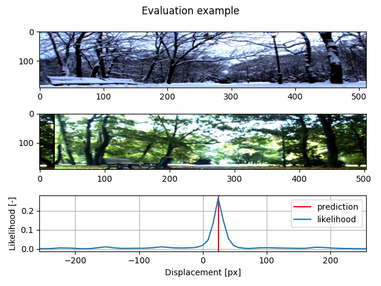
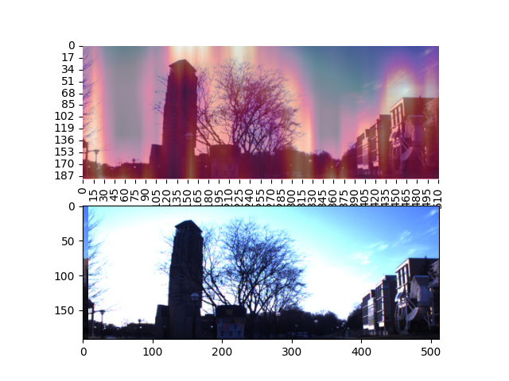

# Siamese network for image registration

Aligns images from different seasons using deep learning.

[Paper](https://www.mdpi.com/1424-8220/22/8/2975)

[Trained model big](https://datasets.chronorobotics.tk/s/yEoarAKM2AVps5R)

[Trained model small](https://datasets.chronorobotics.tk/s/Vov2JlMYl8QTLG8)

## Datasets

[Nordland Rectified](https://datasets.chronorobotics.tk/s/aVD7YOTvtOirYhU)

[EU Longterm (UTBM Robotcar) Rectified](https://datasets.chronorobotics.tk/s/aVD7YOTvtOirYhU)

[Evaluation](https://datasets.chronorobotics.tk/s/QUeUFeUen0942t9)

## Requirements

PyTorch, Torchvision, Scikit-learn

## Demo

Run: `python demo.py`

[Hyperparameter sweep](https://wandb.ai/zdeeno/alignment?workspace=user-zdeeno)

## Heatmap of contributions

Visualisation of importance of parts of image, which were used for the displacement estimation

